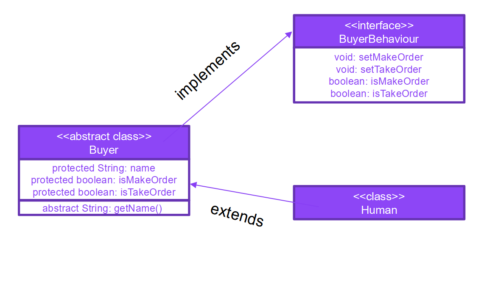
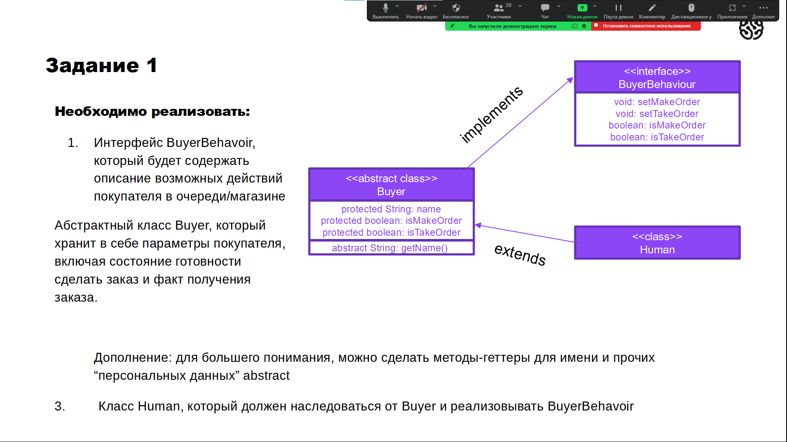
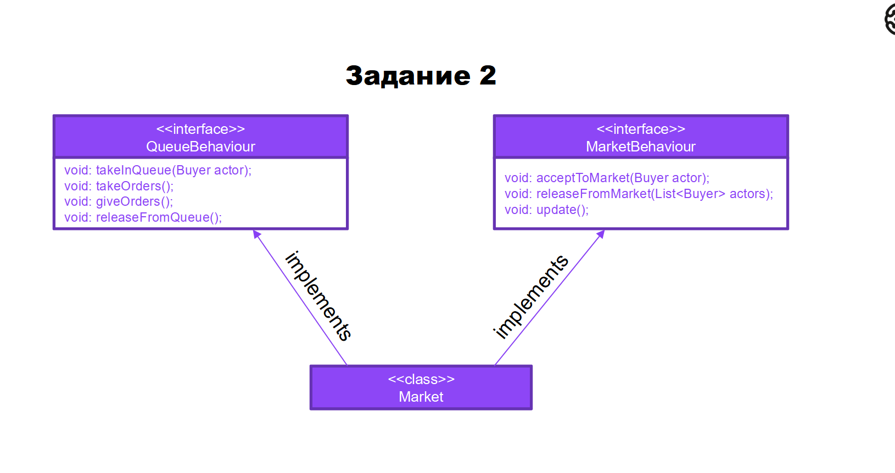

# Seminar_2

1.

2.()

# Homework 2
Реализовать класс Market и все методы, которые он обязан реализовывать.
Методы из интерфейса QueueBehaviour, имитируют работу очереди, MarketBehaviour – помещает и удаляет человека из очереди, метод update – обновляет состояние магазина (принимает и отдаёт заказы)
